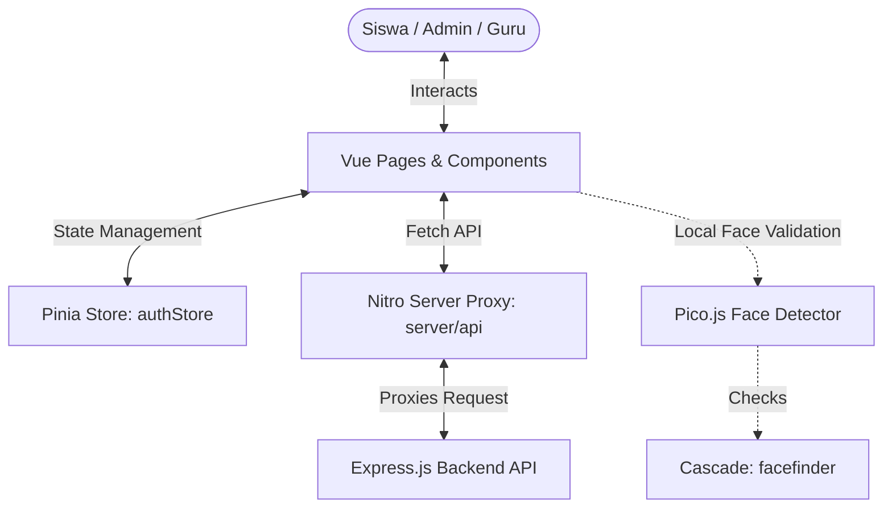

# 🎨 GASKAN Nuxt Frontend

**GASKAN** (Gerbang Akses Pintar dan Kehadiran) Frontend adalah aplikasi web modern, responsif, dan dinamis yang bertindak sebagai dashboard utama bagi Admin, Guru, dan Siswa **SMK SMTI Yogyakarta**. Dibuat menggunakan Nuxt 3 untuk memberikan pengalaman pengguna yang mulus dan cepat.

---

## 📊 Frontend Architecture Graph

Berikut adalah diagram alur bagaimana data mengalir di frontend dan menjalin komunikasi dengan backend:



---

## 📁 Struktur Direktori & Dokumentasi Kode

```
gaskan/
├── components/              # Komponen Vue modular & reusable
│   ├── Landing/             # Komponen khusus halaman landing (Navbar, Hero, dll)
│   ├── Dashboard/           # Layout dashboard berdasarkan peran (Siswa, Admin, Guru)
│   ├── Header/              # Header area aplikasi utama
│   ├── ProfileCard.vue      # Pengelolaan profil & verifikasi wajah absensi siswa
│   └── ...
├── pages/                   # File-system Routing utama Nuxt
│   ├── auth/                # Halaman login & lupa password
│   ├── siswa/               # Dashboard siswa & detail profil (/siswa/[id])
│   ├── admin/               # Panel admin untuk kelola user, kelas, & impor data
│   ├── team.vue             # Halaman profil tim pengembang & pembimbing
│   └── index.vue            # Halaman landing utama sistem
├── server/                  # Nitro Server Engine (API Proxy)
│   ├── api/                 # Proxy endpoints yang meneruskan request ke backend
│   │   ├── profile/         # Gateway upload wajah & biodata
│   │   ├── user.js          # Mapper data profil & fallback foto
│   │   └── ...
│   └── routes/              # Handler asset statis / uploads proxy
├── store/                   # State Management berbasis Pinia
│   └── useAuthStore.ts      # Menyimpan data session & otorisasi pengguna
├── public/                  # Asset statis yang diakses publik langsung
│   ├── pico.js              # Library detektor wajah client-side
│   └── facefinder           # File model cascade pendeteksi wajah
├── nuxt.config.ts           # Konfigurasi modul, Tailwind, & Runtime Config
└── package.json             # Daftar scripts & dependensi frontend
```

---

## ✨ Fitur Unggulan Frontend

1. **🎨 Tampilan Visual Premium**: Estetika modern menggunakan Glassmorphism, skema warna HSL dinamis, dan efek transisi mikro-animasi yang memanjakan mata.
2. **🔐 Role-Based Views**: Dashboard pintar yang secara otomatis menyesuaikan tampilan berdasarkan peran (Admin, Guru, atau Siswa).
3. **🔍 Verifikasi Wajah Instan (Pico.js)**: Sebelum foto diunggah ke database absensi Hikvision, sistem melakukan deteksi wajah secara lokal di browser guna memastikan foto absensi valid dan berkualitas tinggi.
4. **📅 Picker Tahun Fleksibel**: Halaman tim pengembang dilengkapi pemilih periode dinamis berbentuk picker tahun.
5. **🔄 Real-time Update**: Integrasi sinkronisasi websocket secara langsung dari server untuk menampilkan event kehadiran real-time pada halaman landing.

---

## 🚀 Memulai (Quick Start)

### 1. Kloning & Masuk Folder
```bash
cd NewGaskan/gaskan
```

### 2. Konfigurasi Environment
Salin berkas `.env.example` menjadi `.env` dan isi alamat base API backend Anda:
```bash
cp .env.example .env
```

### 3. Instalasi Dependensi
```bash
npm install
```

### 4. Jalankan Server Dev
```bash
npm run dev
```
Buka web di `http://localhost:3000`.

### 5. Build Produksi
Kompilasi berkas untuk mode deployment:
```bash
npm run build
```

---

Made with ❤️ by **GASKAN Team - SMK SMTI Yogyakarta**
